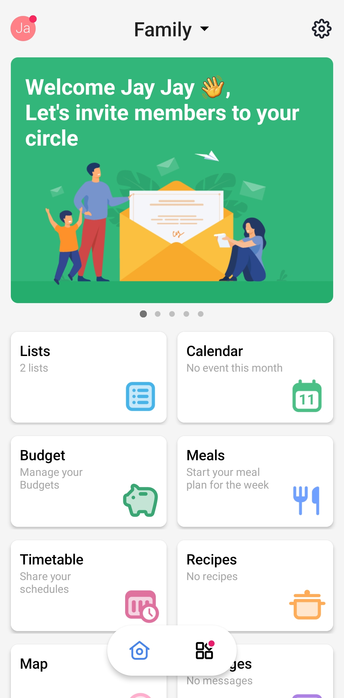
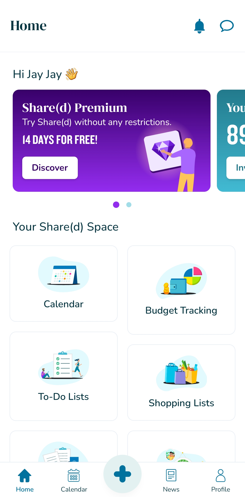
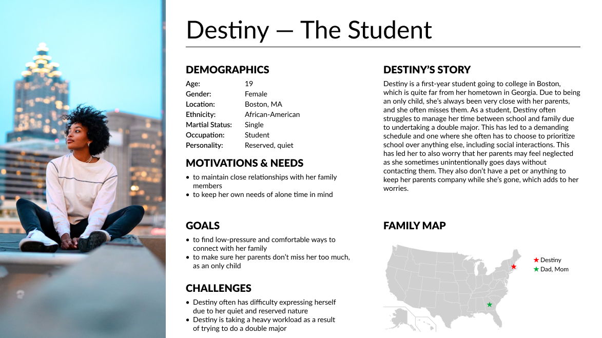
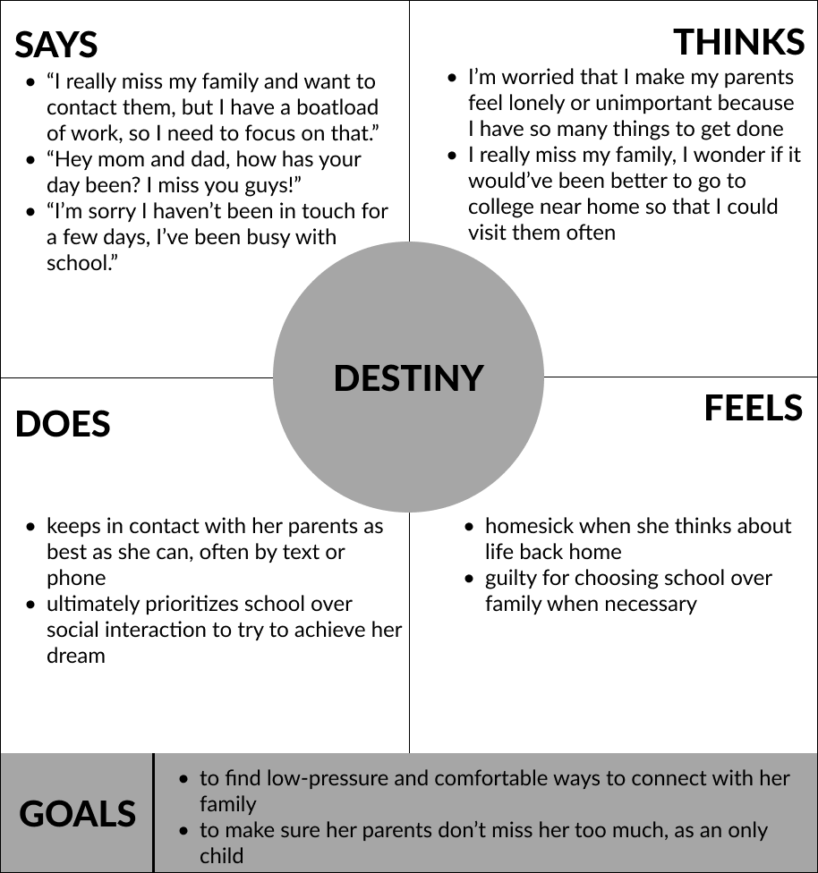
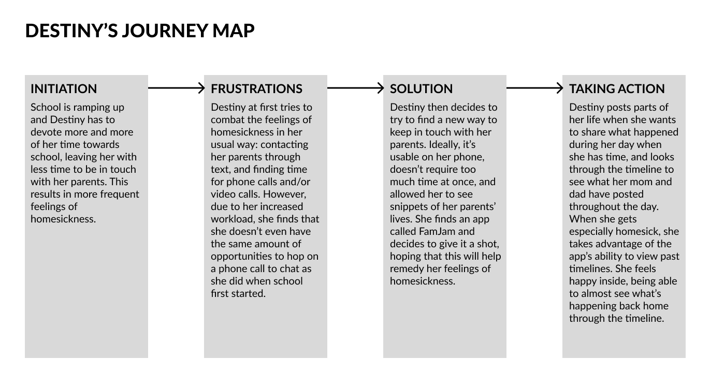
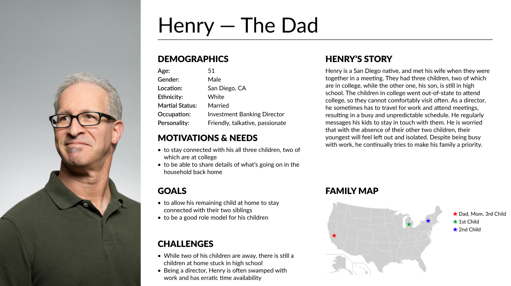
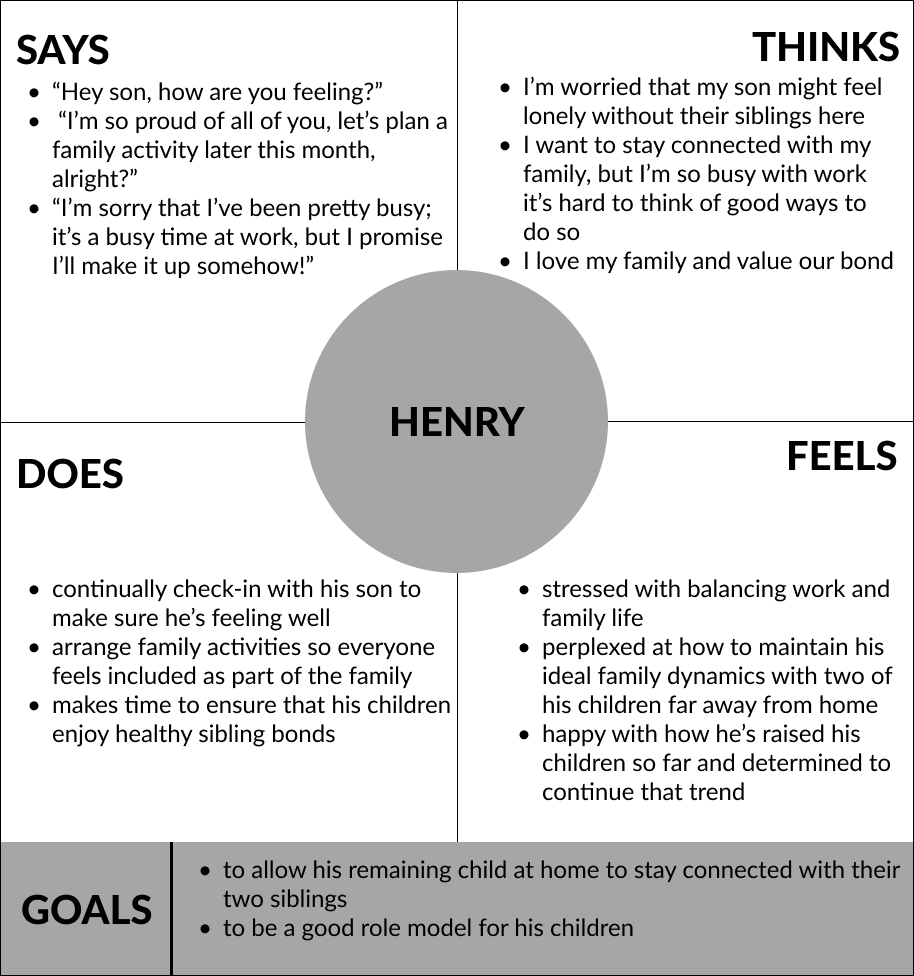
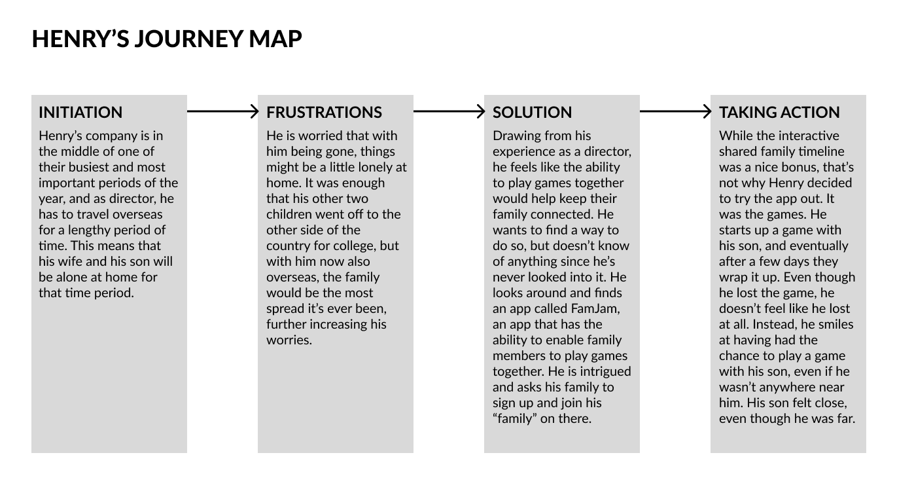
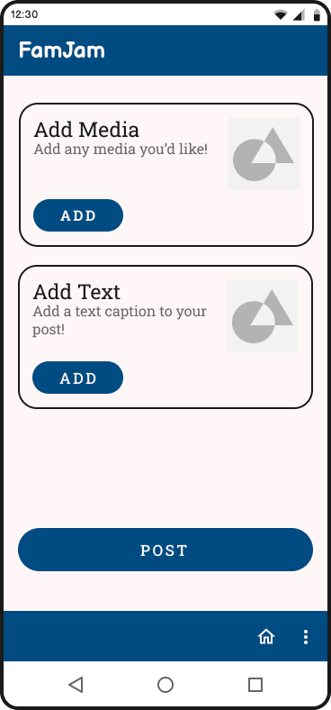

# FamJam
Jay Jay Phoemphoolsinchai | DGT HUM 110 | Spring 2023

---

## About FamJam

FamJam is an app that allows for members of a family to post updates in a timeline fashion. The posts can be one of many different types: text only, text and pictures, pictures only, text and music, and so on. This would allow members to simply post what they want without needing to follow a strict format. Only some small effort from everyone in the family is required to create a beautifully comprehensive timeline for the day with many family members creating interleaving posts, allowing members that may not live near each other to still remain in close contact with each other and know what is happening in each other's lives. Users would also be able to initiate games with family members to enable everyone to have a fun time with each other.

---

## Design Statement

FamJam would give users the ability to share what is going on in their lives with their family members. They would be able to share music, photos, videos, simple text updates, or anything they want to with their family members. This would allow them to stay connected with one another through whichever method they want to use. The problem with available apps is that they often have a structure users must follow, or they don't allow users much customization or settings. Also, they primarily revolve around some form of group messaging. Above all, FamJam prioritizes flexibility and freedom when it comes to choosing how you want to connect with your family members. FamJam aims to transcend other apps and create something akin to a family-only social network.

---

## Competitor Analysis
### Heuristic Analysis

Heuristic Analysis was conducted on two apps that had similar ideas to what FamJam aims to accomplish: FamilyWall and Share(d). This helped highlight any design flaws that are present in the apps that should be avoided for FamJam.

There were also things done well which gave me some helpful ideas and tips for how to design FamJam. Overall, each app seemed to excel at each other's weaknesses. While FamilyWall's design was a bit lacking in terms of identity, it still did its job well and the functionality of the app was good overall. There were a few things missing or bad that mostly revolved around power users and more niche use-cases. Share(d) had a much more distinct visual design, but did not seem as polished. There are quite a few flows that are clunkier than expected and overall less smooth than one would hope.

[Read more about the heuristic analysis](./assignments/assignment1.md)

### Usability Testing
Taking a deeper dive into FamilyWall, usabilty testing was performed to see how usable the app is. Three tasks were made for a participant to perform. The participant managed to complete all of the tasks. However, hearing their thought process was very insightful for thinking about how to design FamJam. I also gained experience in how to conduct usability testing, and also how to create a usability test in the first place.

[Read more about the usability testing and to see the video](./assignments/assignment2.md)

---

## User Research
### Contextual Inquiry
Understanding your target user is important when creating an app or any product in general, and as such, I performed an interview with someone in my target audience who had some family members living decently far apart. I found that having asynchronous methods to connect with family members was essential for people with busy schedules. Overall, I gained insight into what parts of FamJam should be focused on and how to design those parts to optimally address the needs of my target users. As such, essentially everything in FamJam is able to be performed asynchronously.

[Read more about the contextual inquiry and to hear the interview](./assignments/assignment3.md)

---

## UX Storytelling
### Persona and Scenarios
Since it's important to see everything from a potential user's perspective, I made two personas that don't have much overlap: Destiny, the single-child university student, and Henry, the business-busy family-loving dad. For each, I also made an empathy map and a scenario to add more background and detail.
#### **Destiny**

Destiny is a young university student that's very close to her parents, but moves away from them to attend an out-of-state school. She struggles with her own desire to be near them, as well as her desire to make sure her parents don't get too lonely.

#### **Henry**

Henry is a middle-aged banking director that has to travel often for work reasons, and he also has three kids that all live far apart from one another due to school reasons. As a family-loving dad, he struggles with balancing work with family, as well as his desire to keep all of his kids close to one another so they can all be each others' support pillars.

[Read more about these personas, as well as their empathy maps and scenarios](./assignments/assignment4.md)

---

## Prototyping
### Low-Fidelity Prototyping

After taking into account all of the knowledge I gained from the above processes, I made a low-fidelity prototype to explore and examine my planned design to see any potential problems or issues. I had someone help me and trace a flow while going through the two primary tasks I planned to support so that I could see if others not involved in the design process would be able to accomplish the tasks. Their thought process was valuable for me and helped inform my future design decisions.

[Read more about the low-fidelty prototyping process](./assignments/assignment5.md)

### Interface Design

After ensuring that my design was sound, I took steps towards making it seem aesthetically pleasing and also functional for all types of users. I added color and generally more specific details to everything about the low-fidelity prototype, such as typeface. I ensured my color scheme was accessible for everyone and also conducted an impression test with a helping participant to help me decide which iterations to proceed with.

[Read more about the interface design process](./assignments/assignment6.md)

### High-Fidelity Prototyping

When I was pleased with the interface design, I took the leap and made an interactive, high-fidelity prototype of my design so that I could better test the functionality of my proposed design and also conduct a more critical examination of the final color scheme, layout, and overall interface elements. A cognitive walkthrough was also conducted with three peers, which helped me identify some glaring issues that hadn't come up. For instance, while I tried to go for a very minimalistic design, it clearly was too minimalistic according to the results of the process. As such, I can say that the cognitive walkthrough is a very important process to undergo when designing something. 

[Read more about the high-fidelty prototyping process](./assignments/assignment7.md)

---

## Pitch Video
<iframe width="560" height="315" src="https://www.youtube.com/embed/0iFNsYQgTWI" title="YouTube video player" frameborder="0" allow="accelerometer; autoplay; clipboard-write; encrypted-media; gyroscope; picture-in-picture; web-share" allowfullscreen></iframe>

---

## Conclusion
### Evaluation & Reflection
Overall, this was an incredibly engaging and enjoyable process. To become an UX researcher for a bit and partake in conducting user research and design is something completely new to me, and I definitely feel like it was an experience worth my time and effort. I did not realize how user-focused UX even though "user" is in the name: I thought that it was just designing with the user in mind; and while that *is* basically what it is, it's also so much more than *just* "designing with the user in mind". I learned some pretty important things to consider while conducting UX research and UX design that I would not have been able to learn if I had never actually participated in such processes. I had lots of fun when making the prototypes, and it was definitely satisfying to see the final result with all the colors, design decisions, and interactivity—the culmination of all the time and effort put into the process.

If I were to engage in similar processes again in the future, I would have some tips and important ideas to tell my future self. For one, when conducting the contextual inquiry interview, to be adaptive to the participant's answers. I mainly stuck to the script, and in hindsight, I should've gone off-script to gather more specific, interesting information rather than general information. I would also like to do the cognitive walkthrough with the low-fidelity prototype as well, as even though more specific design choices wouldn't have been chosen yet, I can make big, overhauling changes easier than with a high-fidelity prototype. I would also want to flesh out my personas and their respective scenarios more, so that I could step into their shoes better. Unrelated to the process itself, I also would keep in mind various tricks and tips I learned with the tools used for the processes when using them again in the future. For example, my productivity with Figma went up the more I used it due to the amount of new shortcuts and general tricks I learned over time.