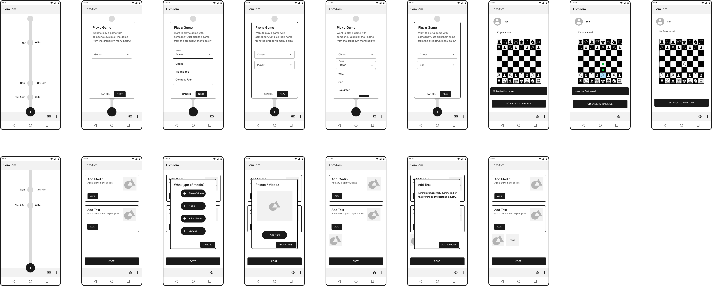

# Low-Fidelity Prototyping
Jay Jay Phoemphoolsinchai | DGT HUM 110 | Spring 2023
## Purpose of Low-Fidelity Prototyping
* The purpose of low-fidelity prototyping is to explore and examine design in the beginning stages of a product development process. Doing so allows one to see any potential problems or issues before investing more significant amounts of time into actually making the product a reality. Otherwise, these problems may arise once there has already been lots of work done, and all those resources and time put into doing so may go to waste if the problems are serious enough. Overall, low-fidelity prototyping is a cost-effective way to quickly identify flaws in early designs.

## Description of Project
* Within each family will be an interactive, shared family timeline. This will allow people to see what their family members are up to and feel more connection with them, almost as if they were able to spectate their family members' lives. 

* Individuals would be able to make posts with multiple different elements, in a very format-free structure. While some might want to only post text updates, others could also embed media and voice memos, or even all of the above! This allows people to express themselves in the way they personally want to, without feeling constricted or forced by the application.

* Individuals would also be able to initiate games with family members. Mostly turn-based, but also a few real-time games for people that have more than just a few minutes at a time. The games will have a full history and replay feature, such that you can relive the game happening on the screen if you wanted to view it again. The games will also be embedded on the timeline, so others can see what's going on.

* User research indicated that something that could be done on an asynchronous basis would be great for families that live many time zones apart. Allowing people to post on the timeline at any time and play turn-based games is an attempt to answer this need. The personas Henry and Destiny made in the previous assignment, and their tasks, playing a game with his son (Henry) and viewing the timeline (Destiny) were chosen as the testing wireflows. In the case with Destiny, it was necessary to add an "Add a post" task since her task was too simple for testing.

---

## Wireframes

The Figma plugin Ink Wireframe was used to make the prototypes.

---

## Wireflow

The Figma plugin Autoflow was used to make the flows.

---

## Testing Wireflow #1 (Based on Persona Henry & Game Task)

The task presented was:
1. Start the process of playing a game with someone.
2. Press the drop-down menu for picking a game.
2. Pick the game named "Chess" as the game.
3. Move on to the next selection.
4. Pick the drop-down menu for picking a player.
4. Pick the person named "Son" as the player.
5. Start the game.
6. Choose the fifth pawn (left-to-right) to move.
7. Move the pawn two squares forward.
8. Go back to the timeline.

Overall, everything went as planned. The participant was able to correctly make a flow through the wireframes, although they did say that at some points, certain things felt a little clunky or too drawn-out. I modified the wireframes by removing one of the screens, which removes a necessary button press from the user's side and gets them through the process sooner.

---

## Testing Wireflow #2 (Based on Persona Destiny & View Task, adding Post)

The task presented was:
1. Scroll down the timeline.
2. Start the process of adding a post.
3. Choose to add a piece of media to your post.
4. Choose to add a photo.
5. Add the photo to the post.
6. Choose to add some text to your post.
7. Add the text to the post.
8. Post.

Similar to before, the participant was able to correctly make a flow through the wireframes. They noted that the flow was pretty good, but that some of the visuals might need tweaking as they got stuck sometimes since the screens looked too similar. Since this is only a low-fidelity prototype and I didn't want to get too detailed in my decisions for the visuals, I didn't choose to revise my prototypes, but definitely will make a note to tweak the visuals.

---

## Reflection
* I tried to be not very descriptive in my description of the tasks, since I didn't want to guide them too much towards the correct answer. However, I was probably too vague at some points, since some of the task directions seem very similar to one another, such that I was almost repeating a direction for another step.
* Making the wireframes was definitely fun, and also a little challenging as I kept tweaking things a little as I was making them, noticing small flaws in my original design in my head that I corrected.
* Based on the feedback I got from the prototype testing, a common comment was that things felt a little repetitive and similar, so I would try to incorporate some elements that makes things look a little different from screen to screen.