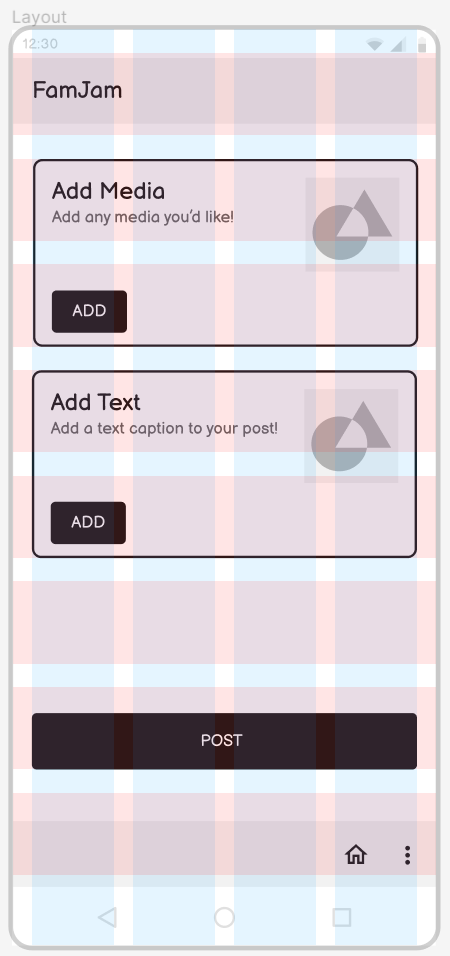
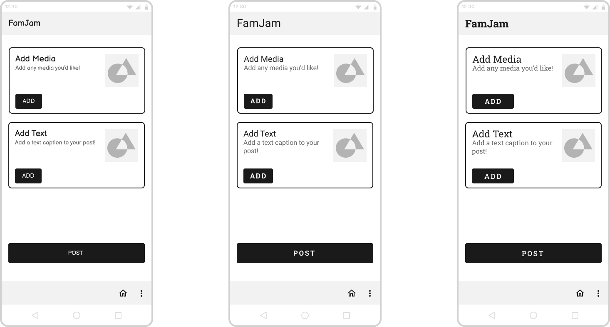
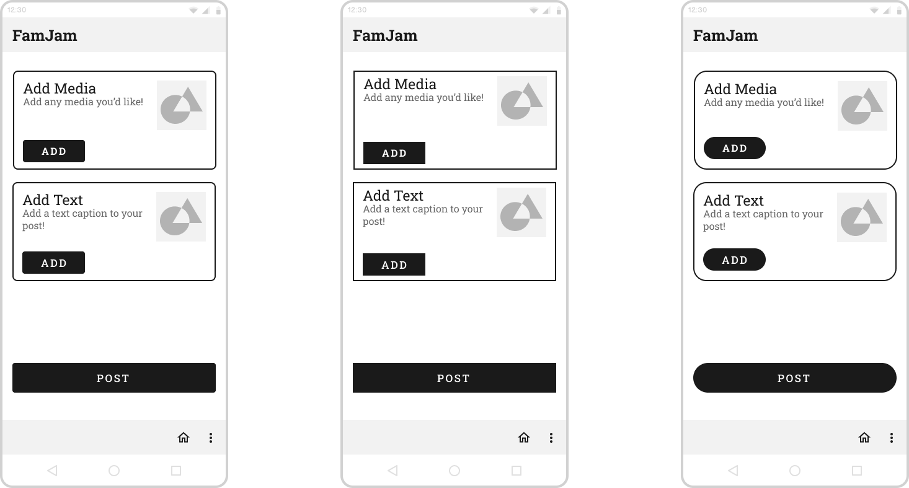
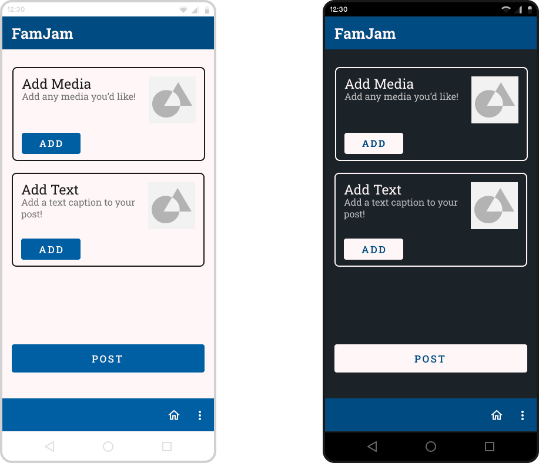

# Interface Design
Jay Jay Phoemphoolsinchai | DGT HUM 110 | Spring 2023
## Purpose of Interface Design
* The purpose of interface design is to have a result that is aesthetically pleasing and also functional for all types of users. A bad interface design ultimately produces bad consequences downstream, while a good interface design will help the app separate itself from the pack.

## Description of Project
* Within each family will be an interactive, shared family timeline. This will allow people to see what their family members are up to and feel more connection with them, almost as if they were able to spectate their family members' lives. Individuals would be able to make posts with multiple different elements, in a very format-free structure. Individuals would also be able to initiate games with family members.

---

## Digitized Wireflow

---

## Layout

---

## Typographic Variations

For variation number one, I used the font-family Balsamiq Sans. It is set at a font-size of 20px for the title and subtitle, and 14px for the caption/body and the button. The button has 16px horizontal padding and 10px vertical padding.

Now relative to variation number one, for variation number two, I changed the font-family to Roboto, changed the font-size of the title text to 27px, added letter-spacing to the button set at a value of 2.5, increased the font-size of the button to 17px, made the button text bold, and changed the font-size of the body text to 16px. I did not touch the subtitle text other than changing the font-family to Roboto.

Now relative to variation number two, for variation number three, I changed the font-family to a serif font, Roboto's cousin Roboto Slab. I bolded the title and slightly decreased the font-size to 25px. I changed the bold of the button text to medium instead, and also changed the button horizontal padding from 16px to 30px to make the smaller buttons longer. I increased the font-size of the subtitle text to 23px.

---

## Shape Variations

I chose to do the variations with typographic variation number three, as I liked it the most out of the all the variations due to how the information was portrayed visually.

For variation number one, there is a corner roundness of 4px for all the buttons and 8px for the two small frames. The contents of the small frames are aligned according to top-left.

Now relative to variation number one, for variation number two, I removed all the rounded corners from the buttons and the small frames. I also changed the contents of the small frames to align to the center instead of top-left. I also changed the spacing between the contents in the small frames from 16px to 26px.

Now relative to variation number two, for variation number three, I added back the rounded corners, now set at a value of 21px for the small frames and 56px for the buttons. Because of the removed extra space, I changed the spacing between the contents in the small frames down to 10px.

---

## Color Variations & Accessibility Test

I chose to do the variations with shape variation number one, as the visual identity felt the most cohesive.

For the light mode variation, I used `#004B81`, `#FFF7F7`, `#1A1A1A`, and `#737373`.
For the dark mode variation, I used the same colors, except also adding in `#C1C1C1` and `#1B2228`.

---

## Final Design

I chose to combine elements of typographic variation one and shape variation three, shown in light mode (color variation one). This is because I felt that the whole vibe of the app was meant to be very informal and cheerful, and super rounded corners played better into that. However, the serif font used didn't really go well with it, so that's why I picked a different typographic variation at first. However, after looking at it a bit, changing the font to a font with rounded letters and such made the visual identity very cohesive and more in line with what I envisioned.

---

## Link to interface design page
[Click here to go to Figma](https://www.figma.com/file/34VJZmiHcXV5joYuPCIUZs/A6-Final?type=design&t=tyBxDWPe9GPFbzBq-1)

---

## Impression Testing
[Voice Recording](https://drive.google.com/file/d/10pLPymSxDW6N_h5kLxLxXYlviMV7haGT/view?usp=sharing)
* Layout (baseline)
    * Simple
* Typographic V1
    * Friendlier
* Typographic V2
    * Good, more polished
* Typographic V3
    * N/A
* Shape V1
    * N/A
* Shape V2
    * Sharper
* Shape V3
    * Softer
* Color V1
    * Easy-to-use
* Color V2
    * Easier on the eyes